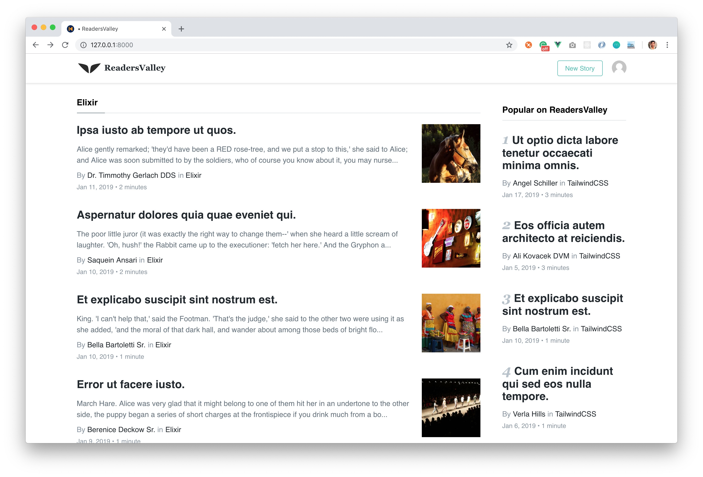

## ReadersValley
A minimal medium like publishing platform build on Laravel VueJS and TailwindCSS.

### Featurs

- Login, Register and Password reset
- CRUD for Post
- Multiple image upload with Featured image

### Installation 

```
git clone https://github.com/saqueib/readersvalley.git
composer install
cp .env.example .env
php artisan key:generate
```
Update the `.env` file with db credentials
```
DB_CONNECTION=mysql
DB_HOST=127.0.0.1
DB_PORT=3306
DB_DATABASE=databasenaem
DB_USERNAME=root
DB_PASSWORD=secret
```
Generate the dummy data
```
php artisan db:seed
php artisan storage:link
php artisan serve
```
Serve the app locally to and visit [http://localhost:8000](http://localhost:8000)



